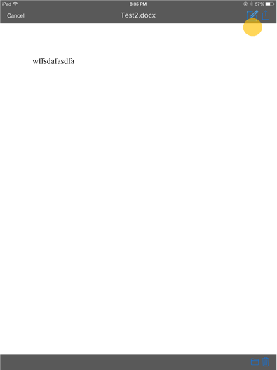

Browsing, opening, and saving files from |Office iOS|
=====================================================

Once you have finished integration with Office for iOS, users will be able to browse, open & save files from your storage location directly in the Office apps as well as open their Office files from your storage location. This section describes the user experience for browsing, opening and saving files from Office for iOS.

.. |AddPlace1| image:: ../images/ScenarioAddPlace.png  
    :alt: A screenshot that shows adding a place in the iOS backstage.
.. |AddPlace2| image:: ../images/ScenarioAddPlace2.png 
    :alt: A screenshot that shows choosing a place from an available list. 
.. |OAuth| image:: ../images/ScenarioOAuth1.png
    :alt: A screenshot that shows an OAuth authentication screen.	
.. |PlaceBrowse| image:: ../images/ScenarioBrowse.png
    :alt: A screenshot that browsing a place after it has been added in the backstage.

.. |AppBrowse| image:: ../images/ScenarioAppBrowse.png
    :alt: A screenshot that shows browsing in a storage app.  

.. |Edit| image:: ../images/ScenarioEdit.png
    :alt: A screenshot that shows editing a file in Office for iOS.

Open from |Office iOS|
----------------------

 #. User selects "Add a Place" in their Office app.
	|AddPlace1|
 #. A list of places comes up and the user selects Contoso.
	|AddPlace2|
 #. The user goes through Contoso's OAuth 2.0 flow.
	|OAuth|
 #. The user can now browse through files stored on Contoso and open them. 
	|PlaceBrowse|
 #. The user can edit the file.
	|Edit|
 

Open From your Cloud Storage App
-------------------------------- 
 
 1. User browses to a file on your iOS app.
	|AppBrowse|
 2. User selects Edit.
	|AppPreview|
 ..  note::
       If you do not have an in-app preview, you may open Office in other screens.	
 3. The file is opened in Office and any saves go back to your service directly.
	|Edit|
 