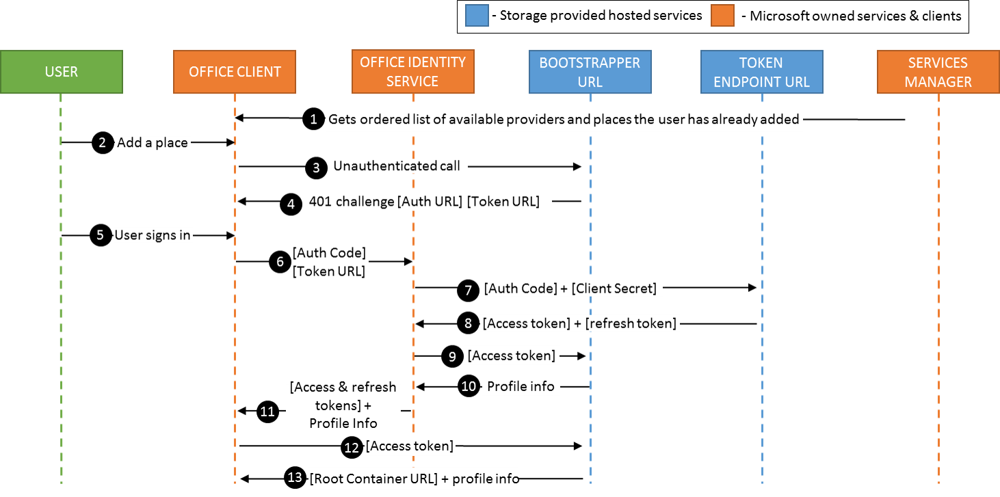

..  _operational flows:

Operational flows
=================

This section outlines the implementation requirements and operational flows for user scenarios outlined in :ref:`Browsing, opening and saving files<browse files>` section. 

**Terminology**

User
   Self-explanatory 

Office Client
   The |Office iOS| app, e.g. Excel/Word/PPT 

Office Identity Service
   The Office Identity service which is Office's service for handling user identity information. In OAuth flows, the Office Identity Service behaves as the External User Agent
 
Bootstrapper URL
   URL which the Storage Provider hosts to allow an Office Client app with a valid Oauth 2.0 access token to retrieve a WOPI access token
 
Token Endpoint URL
   URL which the Storage Provider hosts & uses in order to generate access or refresh tokens 
 
Services Manager
   Office-owned service which stores a Service Catalog, which has all of the available services for an app or endpoint
 
Storage provider
   Refers to a CSPP partner who has integrated their service into |Office iOS|

..  note::
   * Any time during these flows that |Office iOS| tries to hit the bootstrapper and have expired or invalid OAuth credentials, |Office iOS| will ask the user to log in again.
   * Any time during these flows that |Office iOS| has a missing, invalid, or expired WOPI access token, |Office iOS| will attempt to get a valid WOPI access_token by calling :ref:`GetNewAccessToken`.

Add a Place 
~~~~~~~~~~~
This describes the first time a user adds your storage provider using the :guilabel:`Add a Place` in |Office iOS|. To correctly authenticate users, we use the following operational flow in order to connect a user's storage provider account with their |Office iOS| account. 

 
#. When the Office client boots, it calls the Services Manager for a list of available services. The Services manager returns a Service Catalog, which is an alphabetically-sorted list of available providers and places which the user can connect to. 
#. When the user clicks :guilabel:`Add a Place` in the |Office iOS| backstage, they see your Storage Provider listed as an available place. 
#. When the users adds the Storage Provider, the Office client sends an unauthenticated call to the bootstrapper URL.
#. The Bootstrapper URL responds with a 401 challenge as well as the authorization URI and token issue URI. Please note that the Authorization URI must be provided as part of your onboarding information so we can add it as a trusted domain.
#. The Office client loads the authorization URI in a web view which prompts the user to sign in with the service provider.  Once the user finishes the sign in process, the web view reaches a redirect URI which causes it to close. The redirect URI also provides auth code to the Office client. 
#. The Office client sends the auth code & token issue URI to the Office Identity service. 
#. The Office Identity service sends the auth code and the client secret to the Token endpoint.
#. The Token Endpoint issues an access token and a refresh token (if available) back to the Office Identity Service.
#. The Office Identity Service calls the Bootstrapper using the tokens to retrieve the user profile information. 
#. The Office Identity service sends these tokens & the user profile information to the client. 
#. The client uses the OAuth code to call the bootstrap shortcut to obtain a Root Container URL. If the shortcut is not implemented, it calls the Ecosystem URL.
#. The Bootstrapper returns the root container or ecosystem URL, as well as the OAuth token info and profile information to the Office client.
#. The user is now able to see their files under the Storage Provider's Place and open the Storage Provider files directly in their |Office iOS| app. 

Browsing and opening files
--------------------------
Here is the operational flow for browsing and opening files.   

#. *Get the RootContainerURL:* 

    * Option 1: |Office iOS| calls the :ref:`GetRootContainer (bootstrapper)` shortcut which provides all of the required Auth headers. 
    * Option 2: If the :ref:`GetRootContainer (bootstrapper)` shortcut is not implemented, |Office iOS| calls :ref:`GetRootContainer (ecosystem)`. If this call doesn't contain ContainerInfo, use the WOPI URL to call :ref:`CheckContainerInfo`. 

#. *Get the contents of the container:* |Office iOS| calls :ref:`EnumerateChildren` on the RootContainerURL. The results are a set of containers and files in the current container. If the user wants to browse to another container within the current container, |Office iOS| calls :ref:`CheckContainerInfo` on the other container URL. Repeat step 2 until the user navigates to the file they want to open.
#. *Check the File:* Once you have the URL of the file the user wants to open, |Office iOS| calls :ref:`CheckFileInfo` on that file. If the user has permissions to open that file, continue.
#. *Check File Lock:* 

    * If the earlier :ref:`CheckFileInfo` call returned SupportsGetLock==true, |Office iOS| calls :ref:`GetLock`. If the :ref:`GetLock` response is a 409, the file is locked and |Office iOS| does not continue opening it. 
    * If the earlier :ref:`CheckFileInfo <CheckFileInfo>` call returned SupportsGetLock==false, |Office iOS| sends a :ref:`RefreshLock` request with a fake lock token. If the :ref:`RefreshLock` response is a 409 with a lock token in the X-WOPI-Lock response header, the file is locked and |Office iOS| does not continue opening it. 

#. *Take a lock on the file:* |Office iOS| calls :ref:`Lock` on the File's WOPI URL, which returns the lock token which will need to be attached to any PutRequest.
#. *Download the file:* |Office iOS| makes a :ref:`GetFile` request using the File's WOPI URL.

Saving and closing a file
-------------------------
#. *Save the File:* If the user has made changes to the file, |Office iOS| will update the file's contents using PutFile for the File URL. The :ref:`PutFile` request must contain the current WOPI Lock Token for the locked file or it will fail.
#. *Unlock the File:* Make an :ref:`Unlock` request against the File URL to unlock the file. This :ref:`Unlock` request must contain the current WOPI Lock Token for the locked file or it will fail.
 
