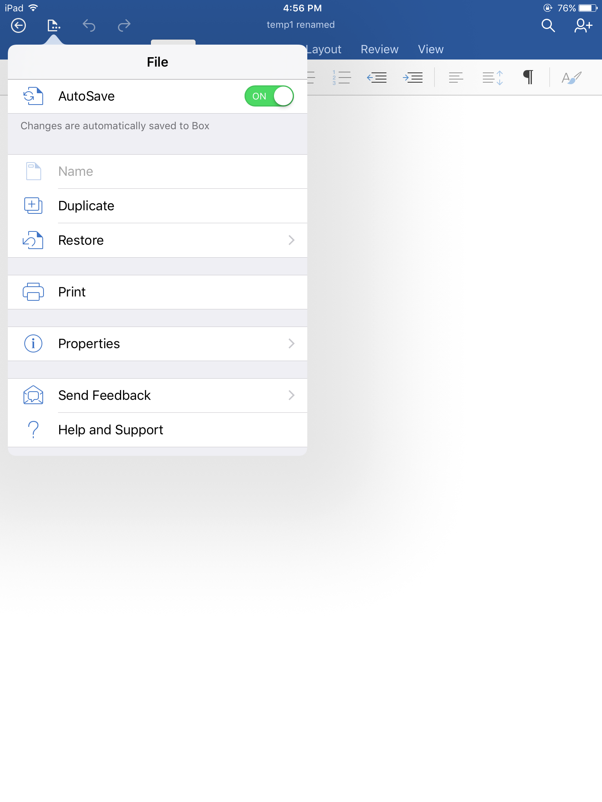
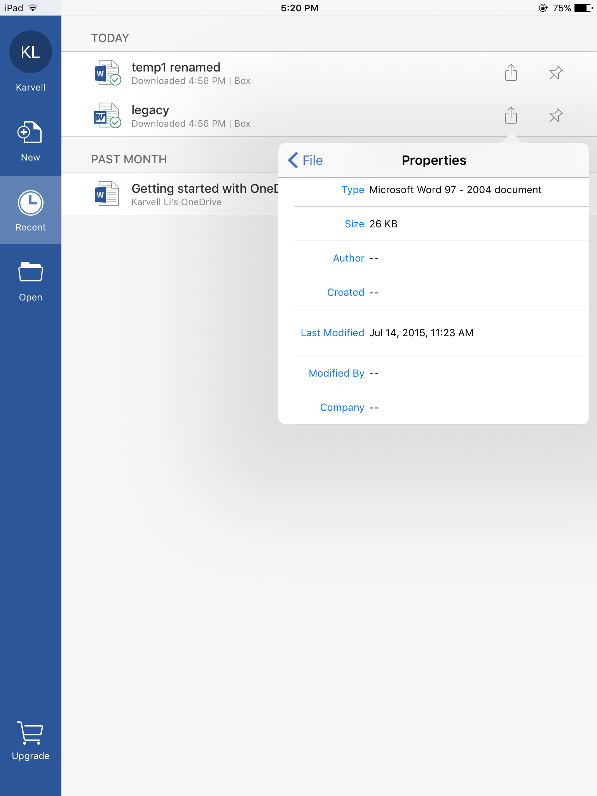
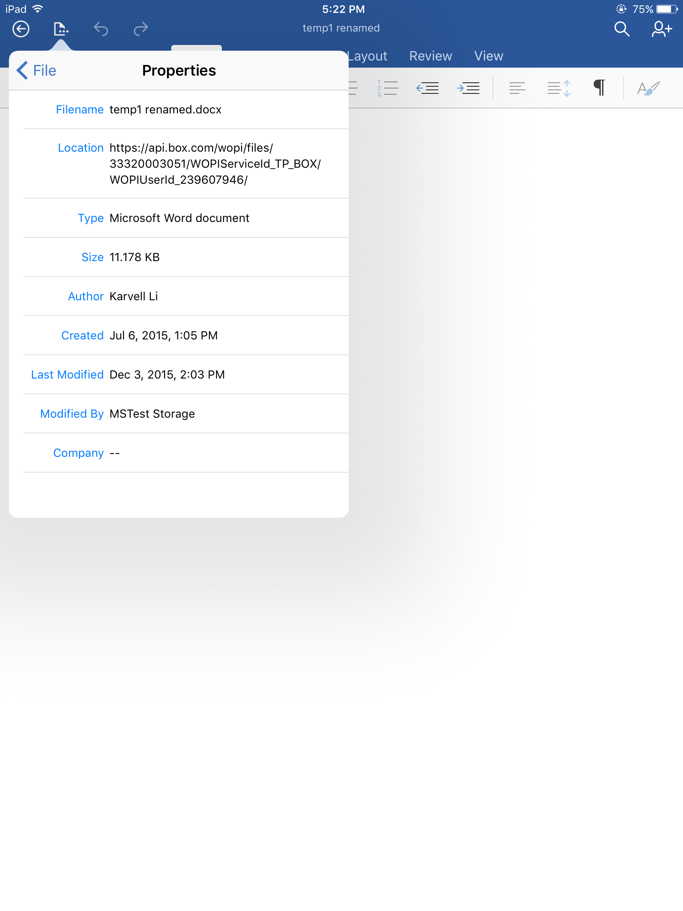

..  _Manual Validation:
Manual Validation
======================
Your WOPI integration can be tested following :ref:`validator app testing <Validator app>`.
However, the validator app will not be able to test the end to end experience 100%. You must run the following tests manually to verify the integration works correctly. Please download the :download:`Report <PartnerTestCasesReport.docx>` document and send it to the Office for iOS integration contacts when your testing is complete. After both the validator and manual tests are passing 100%, please provide Microsoft with a link to your validator app and manual test results. Microsoft will complete a final test pass before launch. 

Please contact Microsoft for directions to set the Office for iOS aps into a test mode that can be used for testing the below scenarios. 

:ref:`Validator app`

-------------------------------------
Notes
-------------------------------------
* "Company app/application" refers to your app. 
* "Company service" refers to your service. 
* Where it refers to "Office", please substitute Word, Excel and PowerPoint app. The tests should be re-run against each Office application. 
* Please note the version of the Office app you tested against. This information can be found under Settings -> [App] -> Version

..  _test1:
-------------------------------------
1 - Open from Company App - First Install
-------------------------------------
*This test verifies the flow of using Office for the first time from the Company app. Repeat for each supported file type and each Office app.*

#. Start with a fresh install of Company app. Ensure Office is not installed.
#. Boot up company app and login.
#. **RESULT: General promotion for Office should be shown the first time after upgrading the company app.**
#. Browse to a supported file type
#. **RESULT: "Open with Microsoft [app]" promotion, drawing attention to control and enabling open with Office once per first open for each supported file type. "Open with Microsoft should be top choice if multiple choices are available. If a list is not shown Office should be the default app for opening the file.**
#. Activate control to open in Office
#. **RESULT: User should be sent to app store page for the corresponding app.**
#. Install the Office app.
#. After installation, go back to the Company app and activate the control to open in Office again.
#. **RESULT: Office should start. User should be prompted for credentials to Company Service.**
#. Enter credentials for company service.
#. **RESULT: File should open in read only mode.**
#. Click sign in and sign in with a free Microsoft Account.
#. **RESULT: File should open in edit mode if user is a consumer and read-only mode if the user is a commercial user.**
#. Make changes [you will need to sign in with a subscription account for testing commercial user]
#. Click Back (<-)
#. Click "Open"
#. **RESULT: Confirm company service is shown as a place.**

-----------------------------------
2 - Open from Office - Fresh Install
-----------------------------------
*This test verifies the flow of using Company Service for the first time from Office.*

#. Launch a fresh install of Office.
#. Go through the First Run Experience.
#. Skip Sign In.
#. Go to Open -> Add a Place
#. **RESULT: Company service shows up. Verify the name and icon of your service.**
#. Select your Company Service.
#. Enter credentials.
#. **RESULT: Root folder should show.**
#. Browse around the folder structure in your service.
#. **RESULT: Browse works as expected.**
#. Open a file from Browse.
#. **RESULT: File should open in read-only mode.**
#. Click sign in and sign in with a free Microsoft Account.
#. **RESULT: File should open in edit mode if user is a consumer and read-only mode if the user is a commercial user.**
#. Make changes [you will need to sign in with a subscription account for testing commercial user]
#. Click Back (<-)
#. Click "Open"
#. **RESULT: File should have the previously saved changes. Ensure changes are being saved on Company service.**

-------------------------------
3 - Open from Company App - Repeat Usage
-------------------------------
Repeat test 1 except with company service already added (i.e. from previous usage).

-------------------------------
4 - Open from Office - Repeat Usage
-------------------------------
Repeat test 2 except with company service already added (i.e. from previous usage).

-------------------------------
5 - Save As [duplicate]
-------------------------------
Verify ability to duplicate to Company Service, both by adding a new place and using an existing place.
|Duplicate|

------------------------------
6 - Create New [name]
------------------------------
Verify ability to duplicate to Company Service, both by adding a new place and using an existing place.

------------------------------
7 - Verify Licensing
------------------------------
Verify editing a file for a commercial user requires O365 subscription or else it opens read only.

Please go to Settings -> [Microsoft App] -> Reset Word -> Delete Sign-In Credentials and restarting Office before doing this test.

------------------------------
8 - OAuth Login Page
------------------------------
Verify there is a link to the company's privacy statement on the company's login page when the user adds the company service as a place.

Verify login page fits in window for various iPad and iPhone sizes.

------------------------------
9 - Verify File Properties 
------------------------------
Verify file properties from Recent and from opened file. When opening the properties from the Recent tab or the Open tab, the fields Author, Created, Modified By and Company will be empty.

|ImageProps1|
	*Properties view from Recent*
|ImageProps2|
	*Properties view from within Document*

----------------------------
10 - Change Passwords
----------------------------
*This test verifies the flow of using Company Service after the user changed passwords.*

*This test changes based on how the Company Service handles authentication and refresh/access tokens. If you invalidate the access and refresh token after the user changes password, run this test. You can adapt this test to ensure the Office app is handling refresh and access tokens correctly.*

#. Launch a fresh install of Office.
#. Go through the First Run Experience.
#. Skip Sign In.
#. Go to Open -> Add a Place
#. Select your Company Service.
#. Enter credentials.
#. Browse around the folder structure in your service.
#. Open a file from Browse.
#. Click sign in and sign in with a free Microsoft Account.
#. Make changes (you will need to sign in with a subscription account for testing commercial user)
#. Click Back
#. On the Company Service app, change the password of the user.
#. Open the Office app and browse to the Company Service and Open a file.
#. **RESULT: You should be prompted to enter credentials again.**
	
